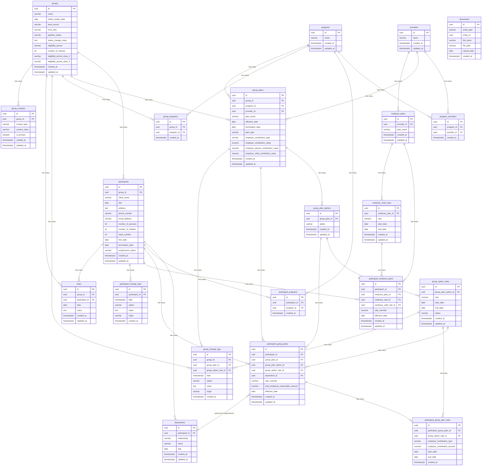

# Database Relationship Diagram

This diagram shows all tables in the database and how they're connected.

## Table Summary

### Core Entities
- **groups** - Client groups/employers
- **participants** - Individual employees/clients
- **programs** - Insurance programs
- **providers** - Insurance providers

### Group Plans (Group Insurance)
- **group_plans** - Plans offered to groups
- **group_plan_options** - Options within a plan
- **group_option_rates** - Rates for plan options
- **participant_group_plans** - Participant enrollment in group plans
- **participant_group_plan_rates** - Rate history for participant plans

### Medicare Plans
- **medicare_plans** - Medicare plans
- **medicare_child_rates** - Child rates for Medicare plans
- **participant_medicare_plans** - Participant enrollment in Medicare plans

### Supporting Tables
- **dependents** - Spouses and children of participants
- **program_providers** - Many-to-many: programs ↔ providers
- **group_programs** - Many-to-many: groups ↔ programs
- **participant_programs** - Many-to-many: participants ↔ programs
- **group_change_logs** - Change history for groups
- **participant_change_logs** - Change history for participants
- **notes** - Notes for groups or participants
- **group_contacts** - Contact information for groups
- **documents** - File attachments (polymorphic)
